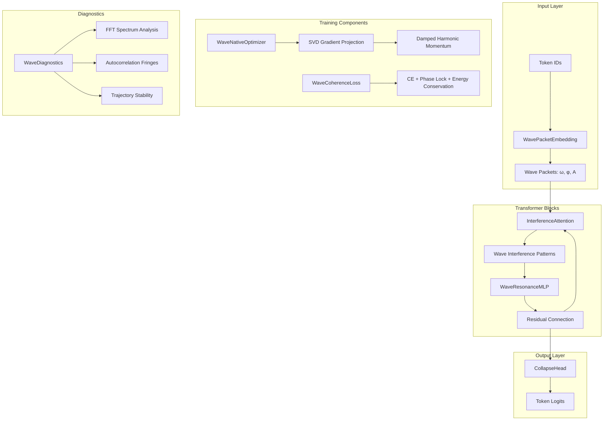

# Design Document: Wave Physics Refactor

## Overview

This design document describes the refactoring of the wave_gpt project from a heuristic prototype into a rigorous first-principles physics engine. The core insight is that neural computation can be modeled as interference patterns in high-dimensional wave fields, where tokens are quantized resonant modes and attention emerges from constructive/destructive interference rather than correlation.

The refactoring introduces:
1. **Physics-aware embeddings** based on mass-frequency relationships (Zipfian distribution)
2. **Interference-based attention** using the wave interference formula instead of dot products
3. **Wave-native optimizer** that preserves phase coherence via SVD projection
4. **Field coherence loss** that minimizes decoherence alongside prediction error
5. **Diagnostic tools** to verify genuine wave signatures in trained models

## Architecture



## Components and Interfaces

### Module 1: WavePacketEmbedding (wave_gpt.py)

**Purpose**: Embed tokens as quantized resonant modes following natural physical laws.

**Interface**:
```python
class WavePacketEmbedding(nn.Module):
    def __init__(
        self,
        vocab_size: int,
        d_model: int,
        num_waves: int = 16,
        num_harmonics: int = 4
    ):
        """
        Initialize physics-aware token embeddings.
        
        Args:
            vocab_size: Number of tokens in vocabulary
            d_model: Output embedding dimension
            num_waves: Number of wave components per token
            num_harmonics: Number of harmonics per wave (1f, 2f, 3f...)
        """
        
    def forward(
        self,
        token_ids: torch.Tensor,
        standard_embed_ratio: float = 0.0
    ) -> torch.Tensor:
        """
        Compute wave packet embeddings with optional annealing.
        
        Args:
            token_ids: (B, T) tensor of token indices
            standard_embed_ratio: Mixing ratio for standard embeddings (0=pure wave, 1=pure standard)
            
        Returns:
            (B, T, d_model) wave packet embeddings
        """
```

**Key Formulas**:
- Token mass: `Mass(i) = 1 / (i + 1)` (Zipfian by rank)
- Base frequency: `ω_0 = 1.0 / sqrt(Mass)`
- Harmonic frequencies: `ω_n = n * ω_0` (strict integer multiples, no noise)
- Harmonic amplitudes: `A_n = 1 / n` (power law decay)
- Annealing: `output = (1 - r) * wave_embed + r * standard_embed`

### Module 2: InterferenceAttention (wave_gpt.py)

**Purpose**: Compute attention via wave interference rather than dot products.

**Interface**:
```python
class InterferenceAttention(nn.Module):
    def __init__(
        self,
        d_model: int,
        num_heads: int,
        num_waves: int = 16,
        dropout: float = 0.1
    ):
        """
        Initialize interference-based attention.
        
        Args:
            d_model: Model dimension
            num_heads: Number of attention heads
            num_waves: Wave components for interference computation
            dropout: Dropout probability
        """
        
    def forward(self, x: torch.Tensor) -> torch.Tensor:
        """
        Compute attention via wave interference.
        
        Args:
            x: (B, T, d_model) input tensor
            
        Returns:
            (B, T, d_model) attended output
        """
```

**Key Formulas**:
- Phase evolution: `φ(t) = ω * t + φ_0`
- Interference intensity: `I(t_q, t_k) = A_q² + A_k² + 2*A_q*A_k*cos(Δω*(t_q - t_k) + Δφ)`
- Normalization: `weights = I / (A_q + A_k)²` (NOT softmax)
- Causality: `torch.triu` mask (future cannot influence past)

### Module 3: WaveNativeOptimizer (wave_physics_core.py)

**Purpose**: Optimize parameters as coupled oscillators, preserving phase coherence.

**Interface**:
```python
class WaveNativeOptimizer(torch.optim.Optimizer):
    def __init__(
        self,
        params: Iterable,
        lr: float = 1e-3,
        damping: float = 0.1,
        coherence_weight: float = 0.7,
        weight_decay: float = 0.01
    ):
        """
        Initialize wave-native optimizer.
        
        Args:
            params: Model parameters
            lr: Learning rate (η)
            damping: Damping coefficient (γ)
            coherence_weight: Weight for coherent gradient (0.7 recommended)
            weight_decay: L2 regularization
        """
        
    def step(self, closure: Optional[Callable] = None) -> Optional[float]:
        """Perform optimization step with SVD projection and damped momentum."""
```

**Key Formulas**:
- SVD decomposition: `U, S, Vh = SVD(W)`
- Coherent gradient: `grad_coherent = U @ (U.T @ grad @ Vh.T) @ Vh`
- Combined gradient: `grad_final = 0.7 * grad_coherent + 0.3 * raw_grad`
- Damped momentum: `v_{t+1} = v_t * (1 - γ) - ∇L * η`
- Parameter update: `θ_{t+1} = θ_t + v_{t+1}`

### Module 4: WaveCoherenceLoss (wave_physics_core.py)

**Purpose**: Minimize field decoherence alongside prediction error.

**Interface**:
```python
class WaveCoherenceLoss(nn.Module):
    def __init__(
        self,
        lambda_phase: float = 0.01,
        lambda_energy: float = 0.01,
        lambda_harmonic: float = 0.01,
        window_size: int = 8
    ):
        """
        Initialize wave coherence loss.
        
        Args:
            lambda_phase: Weight for phase lock regularization
            lambda_energy: Weight for energy conservation regularization
            lambda_harmonic: Weight for harmonic fidelity regularization
            window_size: Window size for local phase variance computation
        """
        
    def forward(
        self,
        logits: torch.Tensor,
        targets: torch.Tensor,
        layer_outputs: Optional[List[torch.Tensor]] = None,
        harmonic_amplitudes: Optional[torch.Tensor] = None
    ) -> Dict[str, torch.Tensor]:
        """
        Compute combined loss with QFE regularization.
        
        Returns:
            Dict with keys: 'total', 'ce', 'coherence'
        """
```

**Key Formulas**:
- Primary loss: `L_CE = CrossEntropyLoss(logits, targets)`
- Phase lock: `L_phase = Var(φ) within local windows`
- Energy conservation: `L_energy = Σ|‖layer_N‖ - ‖layer_{N-1}‖|`
- Harmonic fidelity: `L_harmonic = Σ|A_n - 1/n|`
- Total: `L = L_CE + λ_phase*L_phase + λ_energy*L_energy + λ_harmonic*L_harmonic`

### Module 5: WaveDiagnostics (wave_physics_core.py)

**Purpose**: Verify genuine wave signatures in trained models.

**Interface**:
```python
class WaveDiagnostics:
    def __init__(self, model: nn.Module):
        """Initialize diagnostics for a wave model."""
        
    def analyze_spectrum(self) -> Tuple[bool, Dict[str, float]]:
        """
        Analyze FFT of embeddings for harmonic peaks.
        
        Returns:
            (has_harmonics, metrics_dict)
        """
        
    def visualize_interference(self) -> Tuple[bool, Dict[str, float]]:
        """
        Compute autocorrelation of attention for periodic fringes.
        
        Returns:
            (has_fringes, metrics_dict)
        """
        
    def analyze_trajectories(
        self,
        input_sequence: torch.Tensor
    ) -> Tuple[bool, Dict[str, float]]:
        """
        Track hidden states for bounded/quasi-periodic orbits.
        
        Returns:
            (is_stable, metrics_dict)
        """
```

## Data Models

### WavePacketState
```python
@dataclass
class WavePacketState:
    """State of a wave packet embedding."""
    frequencies: torch.Tensor  # (vocab_size, num_waves) base frequencies
    phases: torch.Tensor       # (vocab_size, num_waves) initial phases
    amplitudes: torch.Tensor   # (vocab_size, num_waves, num_harmonics) harmonic amplitudes
    masses: torch.Tensor       # (vocab_size,) token masses
```

### InterferenceState
```python
@dataclass
class InterferenceState:
    """State of interference attention computation."""
    query_freq: torch.Tensor   # (B, H, T, W) query frequencies
    query_phase: torch.Tensor  # (B, H, T, W) query phases
    query_amp: torch.Tensor    # (B, H, T, W) query amplitudes
    key_freq: torch.Tensor     # (B, H, T, W) key frequencies
    key_phase: torch.Tensor    # (B, H, T, W) key phases
    key_amp: torch.Tensor      # (B, H, T, W) key amplitudes
    intensity: torch.Tensor    # (B, H, T, T) interference intensity matrix
```

### DiagnosticResults
```python
@dataclass
class DiagnosticResults:
    """Results from wave diagnostics."""
    has_harmonic_peaks: bool
    harmonic_peak_ratios: List[float]  # Ratios of f, 2f, 3f peaks
    has_interference_fringes: bool
    fringe_period: float
    is_trajectory_stable: bool
    lyapunov_exponent: float  # Negative = stable
```

## Correctness Properties

*A property is a characteristic or behavior that should hold true across all valid executions of a system-essentially, a formal statement about what the system should do. Properties serve as the bridge between human-readable specifications and machine-verifiable correctness guarantees.*

### Property 1: Zipfian Mass Distribution
*For any* vocabulary size V and token index i in [0, V), the computed token mass SHALL equal 1/(i+1) (up to normalization).
**Validates: Requirements 1.1**

### Property 2: Mass-Frequency Inverse Relationship
*For any* token with mass M, the base frequency ω_0 SHALL equal 1/√M, ensuring heavy tokens have low frequencies and light tokens have high frequencies.
**Validates: Requirements 1.2**

### Property 3: Harmonic Quantization Exactness
*For any* base frequency ω_0 and harmonic number n ∈ {1, 2, 3, ...}, the harmonic frequency SHALL equal exactly n * ω_0 with zero random noise.
**Validates: Requirements 1.3**

### Property 4: Power Law Amplitude Decay
*For any* harmonic number n, the initial amplitude SHALL be proportional to 1/n.
**Validates: Requirements 1.4**

### Property 5: Embedding Annealing Linearity
*For any* standard_embed_ratio r ∈ [0, 1], wave embedding W, and standard embedding S, the output SHALL equal exactly (1-r)*W + r*S.
**Validates: Requirements 1.5**

### Property 6: Phase Evolution Formula
*For any* position t, frequency ω, and initial phase φ_0, the evolved phase SHALL equal ω*t + φ_0.
**Validates: Requirements 2.2**

### Property 7: Interference Intensity Formula
*For any* query position t_q, key position t_k, amplitudes A_q and A_k, frequency difference Δω, and phase difference Δφ, the intensity SHALL equal A_q² + A_k² + 2*A_q*A_k*cos(Δω*(t_q - t_k) + Δφ).
**Validates: Requirements 2.3**

### Property 8: Causal Masking Enforcement
*For any* sequence length T and positions q, k where k > q, the attention weight SHALL be zero (future cannot influence past).
**Validates: Requirements 2.4**

### Property 9: Energy-Based Normalization (Non-Softmax)
*For any* attention computation, the normalization SHALL use (A_q + A_k)² rather than softmax, allowing output values to exceed 1.0.
**Validates: Requirements 2.5**

### Property 10: SVD Gradient Projection
*For any* 2D weight matrix W and gradient G, the coherent gradient SHALL equal U @ (U.T @ G @ Vh.T) @ Vh where U, S, Vh = SVD(W).
**Validates: Requirements 3.1, 3.2**

### Property 11: Gradient Combination Weights
*For any* coherent gradient G_c and raw gradient G_r, the final gradient SHALL equal 0.7*G_c + 0.3*G_r.
**Validates: Requirements 3.3**

### Property 12: Damped Harmonic Parameter Update
*For any* velocity v_t, damping γ, gradient ∇L, learning rate η, and parameters θ_t, the update SHALL follow: v_{t+1} = v_t*(1-γ) - ∇L*η and θ_{t+1} = θ_t + v_{t+1}.
**Validates: Requirements 3.4, 3.5**

### Property 13: Cross-Entropy Component Correctness
*For any* logits and targets, the CE component of WaveCoherenceLoss SHALL equal torch.nn.CrossEntropyLoss output.
**Validates: Requirements 4.1**

### Property 14: Loss Dictionary Structure
*For any* WaveCoherenceLoss computation, the return value SHALL be a dictionary containing keys 'total', 'ce', and 'coherence'.
**Validates: Requirements 4.5**

### Property 15: Harmonic Peak Detection
*For any* embedding with known harmonic content at frequencies f, 2f, 3f, the spectrum analyzer SHALL return True; for embeddings without harmonic structure, it SHALL return False.
**Validates: Requirements 5.1**

### Property 16: Annealing Schedule Linearity
*For any* training step s ∈ [0, 3000], the standard_embed_ratio SHALL equal max(0, 1.0 - s/3000).
**Validates: Requirements 6.1**

### Property 17: API Compatibility
*For any* input tensor of shape (B, T), the refactored model SHALL accept the same inputs and produce outputs of the same shape as the original wave_gpt model, supporting temperature, top_k, and max_length generation parameters.
**Validates: Requirements 7.1, 7.3, 7.4**

### Property 18: Component Independence
*For any* configuration, each physics component (wave embeddings, interference attention, RGD, QFE) SHALL be independently toggleable without breaking model functionality.
**Validates: Requirements 7.5**

## Error Handling

### Numerical Stability
- **SVD Convergence**: If SVD fails to converge, fall back to raw gradient without projection
- **Phase Singularities**: When amplitude approaches zero, skip phase-based computations to avoid division by zero
- **Gradient Explosion**: Clip gradients to max norm of 1.0 before applying wave-native updates
- **NaN Detection**: Check for NaN/Inf after each forward pass and raise informative error

### Configuration Validation
- **Parameter Count**: Assert 50M < params < 55M for fair comparison runs
- **Dimension Compatibility**: Validate d_model is divisible by num_heads
- **Harmonic Bounds**: Ensure num_harmonics >= 1 and num_waves >= 1

### Graceful Degradation
- **Missing Components**: If WaveNativeOptimizer unavailable, fall back to AdamW with warning
- **Memory Constraints**: If SVD OOMs on large matrices, skip coherent projection for that layer

## Testing Strategy

### Property-Based Testing Framework
The implementation SHALL use **Hypothesis** (Python) for property-based testing, configured to run a minimum of 100 iterations per property.

### Unit Tests
Unit tests SHALL cover:
1. Embedding initialization correctness (mass, frequency, amplitude values)
2. Attention mask application (causal constraint)
3. Loss component computation (CE matches PyTorch reference)
4. Optimizer state management (momentum, velocity tracking)
5. Diagnostic output format (dictionary structure)

### Property-Based Tests
Each correctness property SHALL be implemented as a property-based test with the following annotation format:
```python
# **Feature: wave-physics-refactor, Property {N}: {property_text}**
# **Validates: Requirements X.Y**
```

Property tests SHALL:
1. Generate random valid inputs using Hypothesis strategies
2. Verify the mathematical formula/constraint holds
3. Run minimum 100 iterations to catch edge cases

### Integration Tests
Integration tests SHALL verify:
1. End-to-end training loop with all physics components
2. Checkpoint save/restore with physics optimizer state
3. Generation quality with pure wave embeddings
4. Compatibility with existing visualization tools

### Test Organization
```
tests/
├── test_wave_physics_core.py      # Optimizer, Loss, Diagnostics
├── test_wave_embeddings.py        # WavePacketEmbedding properties
├── test_interference_attention.py # InterferenceAttention properties
├── test_integration.py            # End-to-end tests
└── conftest.py                    # Shared fixtures and strategies
```

## Benchmark Integration

### wave_benchmark.py Updates

The benchmark module requires updates to use the new physics-first components:

**Import Changes**:
```python
# Old (heuristic)
from physics_optim import ResonantGradientDescent, QuantumFieldEntanglementLoss

# New (physics-first)
from wave_physics_core import WaveNativeOptimizer, WaveCoherenceLoss, WaveDiagnostics
```

**Annealing Integration**:
```python
def get_annealing_ratio(step: int, total_annealing_steps: int = 3000) -> float:
    """Compute standard_embed_ratio for annealing schedule."""
    return max(0.0, 1.0 - step / total_annealing_steps)

# In training loop:
ratio = get_annealing_ratio(step)
logits, loss = model(x, y, standard_embed_ratio=ratio)
```

**Diagnostic Integration**:
```python
# After training completes:
diagnostics = WaveDiagnostics(model)

# Verify wave signatures
has_harmonics, spectrum_metrics = diagnostics.analyze_spectrum()
has_fringes, interference_metrics = diagnostics.visualize_interference()
is_stable, trajectory_metrics = diagnostics.analyze_trajectories(sample_input)

# Log results
console.print(f"Harmonic Peaks: {'✓' if has_harmonics else '✗'}")
console.print(f"Interference Fringes: {'✓' if has_fringes else '✗'}")
console.print(f"Trajectory Stability: {'✓' if is_stable else '✗'}")
```

## Backward Compatibility

### Migration Path from physics_optim.py

The legacy `physics_optim.py` module will be maintained with deprecation warnings:

```python
# physics_optim.py (updated)
import warnings

class ResonantGradientDescent(torch.optim.Optimizer):
    def __init__(self, *args, **kwargs):
        warnings.warn(
            "ResonantGradientDescent is deprecated. "
            "Use WaveNativeOptimizer from wave_physics_core instead.",
            DeprecationWarning,
            stacklevel=2
        )
        super().__init__(*args, **kwargs)
        # ... existing implementation
```

### Compatibility Shim in wave_physics_core.py

```python
def create_physics_optimizer(
    model: nn.Module,
    lr: float = 3e-4,
    use_resonance: bool = True,
    resonance_strength: float = 0.3,  # Maps to coherence_weight
    warmup_steps: int = 500,
    weight_decay: float = 0.01
) -> torch.optim.Optimizer:
    """
    Compatibility function matching physics_optim.py signature.
    Returns WaveNativeOptimizer with equivalent configuration.
    """
    if use_resonance:
        return WaveNativeOptimizer(
            model.parameters(),
            lr=lr,
            coherence_weight=resonance_strength,
            damping=0.1,
            weight_decay=weight_decay
        )
    else:
        return torch.optim.AdamW(model.parameters(), lr=lr, weight_decay=weight_decay)


def create_physics_loss(
    use_qfe: bool = True,
    lambda_coherence: float = 0.05,
    amplitude_threshold: float = 0.01,
    projection_dim: int = 256
) -> nn.Module:
    """
    Compatibility function matching physics_optim.py signature.
    Returns WaveCoherenceLoss with equivalent configuration.
    """
    if use_qfe:
        return WaveCoherenceLoss(
            lambda_phase=lambda_coherence,
            lambda_energy=lambda_coherence,
            lambda_harmonic=lambda_coherence
        )
    else:
        return nn.CrossEntropyLoss()
```
